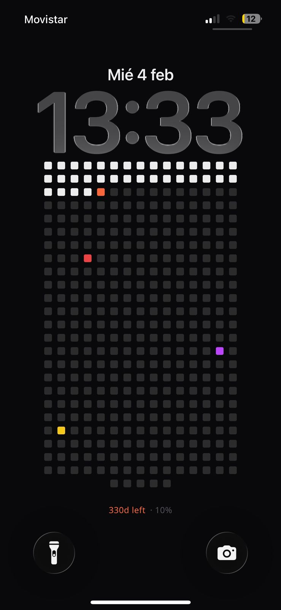

# Year Tiles

A minimal year-at-a-glance tile calendar. Mark special dates with colors and labels, pick your time zone, and generate a shareable wallpaper link.




## Features
- Year grid with daily tiles and hover labels
- Special dates with color, label, and optional birthday highlight
- Time zone selection and automatic day rollover
- Shareable image link with wallpaper sizes

## Getting Started

```bash
npm install
npm run dev
```

Open `http://localhost:3000`.

## Build

```bash
npm run build
npm run start
```

## Optional: Profile Storage
Share links can persist by storing profiles in Vercel Blob. Set `BLOB_BASE_URL` to the public base URL for your blob store.

## Automation (iOS Shortcuts)

After you click **Copy** in the app, follow these steps to set up the daily wallpaper:

1. Open the **Shortcuts** app → **Automation** tab → **New Automation**.
2. Pick **Time of Day** → `6:00 AM` → Repeat **Daily** → **Run Immediately** → **Create New Shortcut**.
3. Add action `Get Contents of URL` → paste the Automation Link you copied from Year Tiles.
4. Add action `Set Wallpaper Photo` → choose **Lock Screen**.
5. Important: In `Set Wallpaper Photo`, tap the arrow (→) to show options, then disable **Crop to Subject** and **Show Preview**. This prevents iOS from cropping and asking for confirmation each time.


## Screenshots


